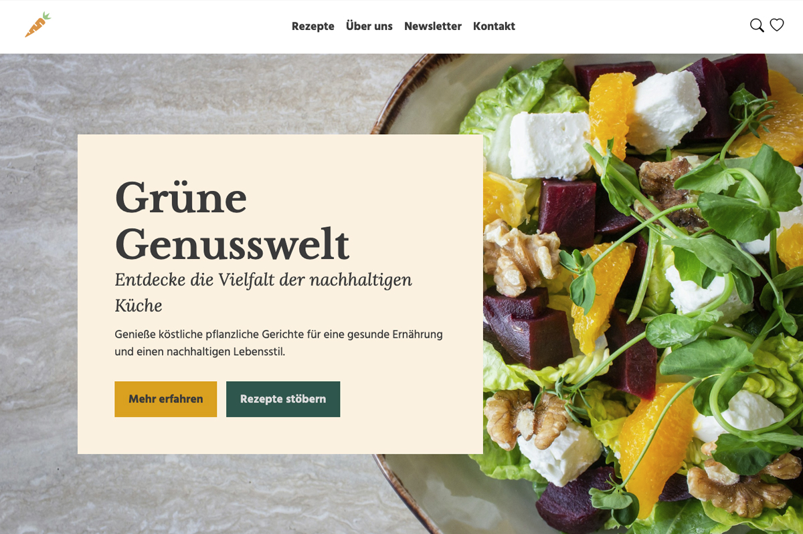
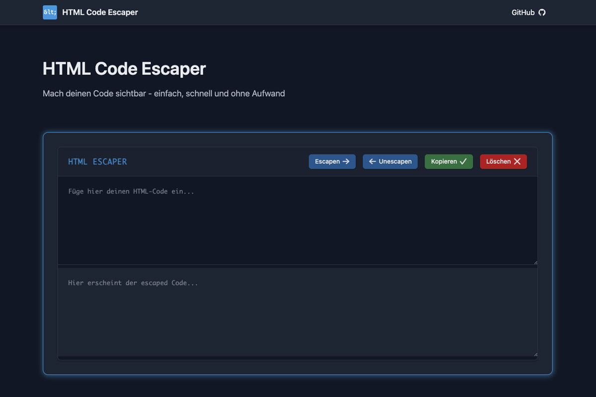

# Hi there! 🤘

I'm Bianca.

Semantic structure. Human-readable URLs. No noise — at least not in my code.

**Colorful · Curious · Creative · Reliable**

I build privacy-first web tools that run locally in your browser - 
no tracking, no data collection, just functionality and style.

...and yes — even WordPress.

## What You'll Find Here

Personal projects exploring web development fundamentals:
- Tools that solve real problems
- Clean, accessible code (WCAG AA)
- Bilingual interfaces (DE/EN)
- Dark/light mode

## My Philosophy

**Learning by doing.**  
Understanding every line of code I write.  
Building my skills one project at a time.

## Currently Working With

`HTML` · `CSS` · `JavaScript` · `GitHub Pages` · `WordPress`

---
## Featured Projects

| | |
|---|---|
|  |  | 
| **HTML Entity Encoder** | **PunkRock Gadgets** | 
| Privacy-first text tool | 80s neon electronics shop | 

| | |
|---|---|
|  |  | 
| **Grüne Genusswelt** | **HTML Code Escaper** | 
| Web development course | Escape and unescape HTML entities |

---

*Reliable, detail-oriented and always learning something new.*
