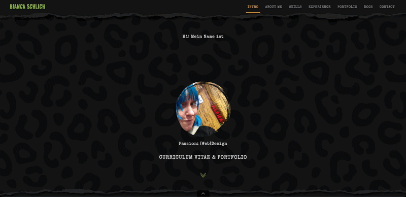
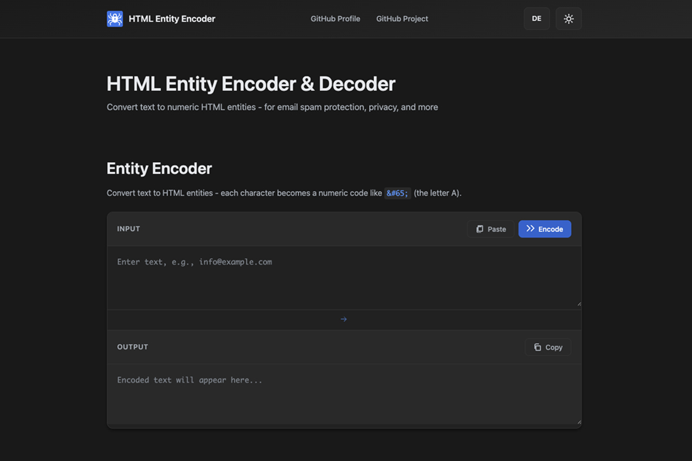
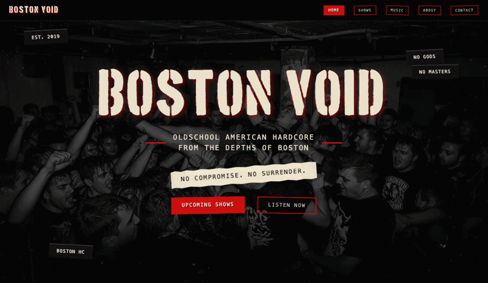
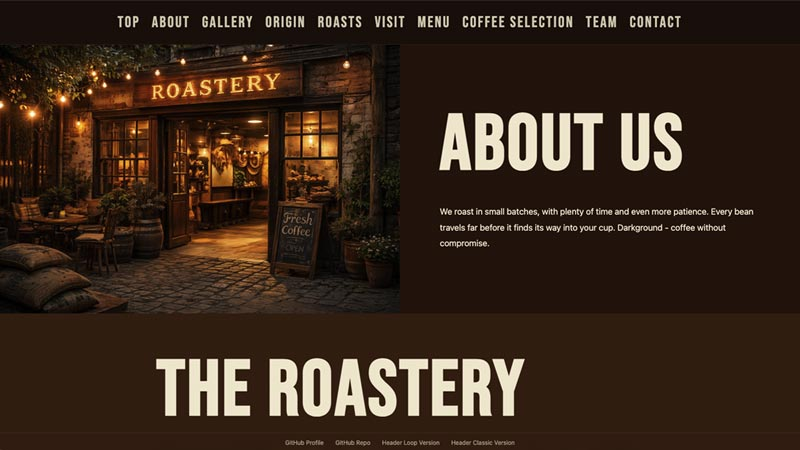
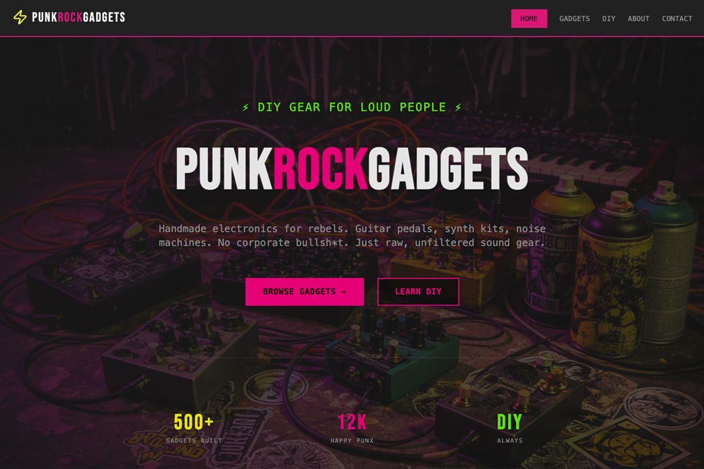

# Hi there! 🤘

I'm Bianca.

From signmaker to the web.  
From vinyl to viewport.  
Zero noise. Built loud.

**Colorful · Curious · Creative · Reliable**

Semantic structure. Human-readable URLs. No noise - at least not in my code.

I build privacy-first websites and web tools that run locally in your browser.  
No tracking, no data collection, just functionality and style.

...and yes. Even WordPress.

## What You'll Find Here

Personal projects exploring web development fundamentals:
- Tools that solve real problems
- Clean, accessible code (WCAG AA)
- Bilingual interfaces (DE/EN)
- Dark/light mode

## My Philosophy

**Learning by doing.**  
No copy-paste without understanding.  
Building my skills one project at a time.

## Currently Building With

`HTML` · `CSS` · `GitHub Pages` · `WordPress` · `JavaScript`

---
# Featured Projects

  

### HTML Entity Encoder  
Privacy-first tool to encode special characters for safe HTML output. 

 &nbsp; 
 

 

---

  

### Boston Void  
Fictional American hardcore band - concept-driven one-pager. 

 &nbsp; 
 

 

---

  

### Darkground Coffee  
Demo site - endless scroll loop with CSS animations, vanilla HTML/CSS/JS. 

 &nbsp; 
 

 

---

  

### PunkRock Gadgets  
Fictional 80s neon electronics shop. 

 &nbsp; 
 

 

---
---
---

*Reliable, detail-oriented and always learning something new.*
